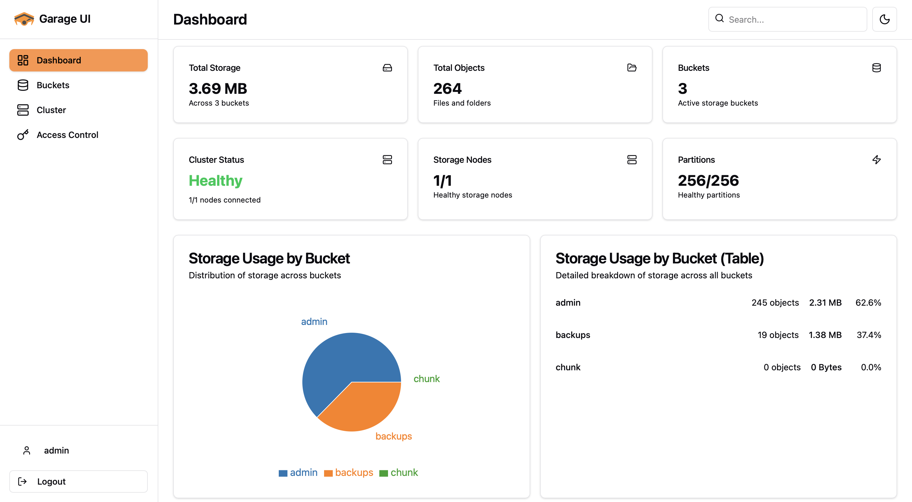
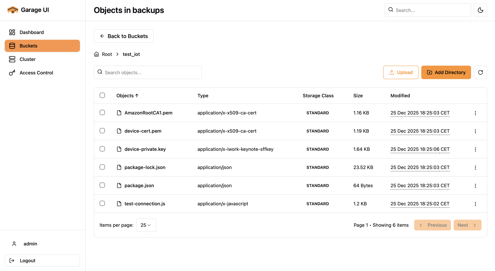
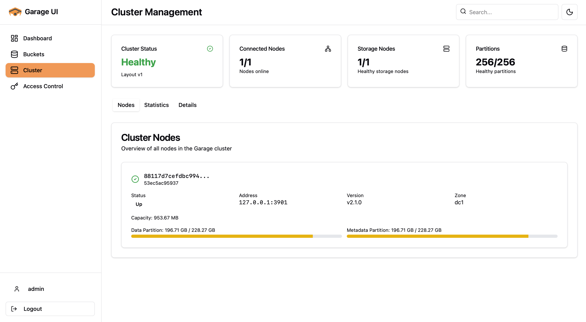
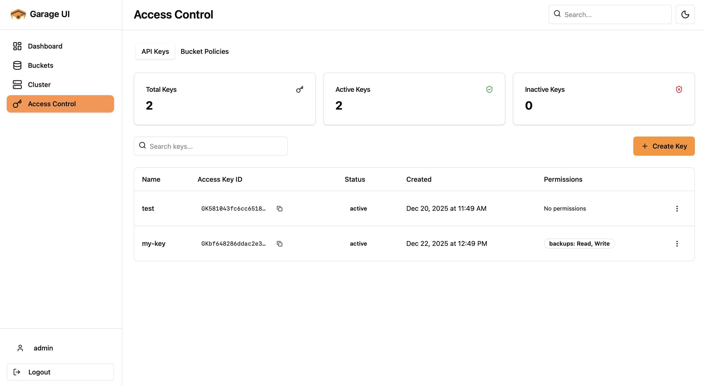

# Garage UI

A web interface for managing [Garage](https://garagehq.deuxfleurs.fr/) object storage clusters.

[](https://github.com/Noooste/garage-ui/actions/workflows/build.yml)
[](https://github.com/Noooste/garage-ui/actions/workflows/release.yml)
[](https://opensource.org/licenses/MIT)
[](https://go.dev/)
[](https://nodejs.org/)
[](https://artifacthub.io/packages/search?repo=garage-ui)

---

<table>
  <tr>
    <td></td>
    <td></td>
  </tr>
  <tr>
    <td></td>
    <td></td>
  </tr>
</table>

## Features

- Bucket and object management
- User access control
- Cluster monitoring
- Multiple authentication options (none/basic/OIDC)
- Drag-and-drop file uploads

## Quick Start

### Prerequisites

- Docker & Docker Compose
- Garage S3 cluster (v2.1.0+) or use the included setup

### 1. Clone & Setup

```bash
git clone https://github.com/Noooste/garage-ui.git
cd garage-ui
```

### 2. Start Garage

If you don't have Garage running:

```bash
docker-compose up -d garage
sleep 10

# Initialize cluster
docker-compose exec garage garage layout assign -z dc1 -c 1G $(docker-compose exec garage garage node id -q)
docker-compose exec garage garage layout apply --version 1

# Create admin key
docker-compose exec garage garage key create admin-key
```

Save the access key and secret key from the output.

### 3. Configure

```bash
cp config.yaml.example config.yaml
```

Edit `config.yaml` with your Garage endpoints and admin token (from `garage.toml`).

### 4. Start UI

```bash
docker-compose up -d garage-ui
```

Access at http://localhost:8080

## Configuration

Minimum required config:

```yaml
server:
  port: 8080

garage:
  endpoint: "http://garage:3900"
  admin_endpoint: "http://garage:3903"
  admin_token: "your-admin-token"
  region: "garage"
```

Enable authentication (optional):

```yaml
auth:
  admin:
    enabled: true
    username: "admin"
    password: "your-password"
```

See [config.yaml.example](config.yaml.example) for all options.

### Environment Variables

Override any config value with `GARAGE_UI_` prefix:

```bash
GARAGE_UI_SERVER_PORT=8080
GARAGE_UI_GARAGE_ENDPOINT=http://garage:3900
GARAGE_UI_GARAGE_ADMIN_TOKEN=your-token
```

## Deployment

### Docker

```bash
docker run -d -p 8080:8080 \
  -v $(pwd)/config.yaml:/app/config.yaml \
  noooste/garage-ui:latest
```

### Kubernetes

```bash
helm repo add garage-ui https://helm.noste.dev/
helm install garage-ui garage-ui/garage-ui \
  --set garage.endpoint=http://garage:3900 \
  --set garage.adminEndpoint=http://garage:3903 \
  --set garage.adminToken=your-token
```

## Development

Backend (Go 1.25+):
```bash
cd backend
go run main.go --config ../config.yaml
```

Frontend (Node.js 25+):
```bash
cd frontend
npm install
npm run dev
```

API docs: http://localhost:8080/api/v1/

## Garage Configuration

Garage UI requires these settings in your `garage.toml`:

```toml
# Admin API (required for Garage UI)
[admin]
api_bind_addr = "0.0.0.0:3903"  # Default: 127.0.0.1:3903
admin_token = "your-admin-token" # Generate with: openssl rand -base64 32

# S3 API
[s3_api]
s3_region = "garage"             # Default: "garage"
api_bind_addr = "[::]:3900"      # Default: 127.0.0.1:3900
```

**Important:** The `admin_token` and `s3_region` in `garage.toml` must match your Garage UI `config.yaml`.

For complete Garage configuration, see the [official documentation](https://garagehq.deuxfleurs.fr/documentation/reference-manual/configuration/).

## Troubleshooting

**Connection failed:**
```bash
curl http://localhost:3903/status -H "Authorization: Bearer your-token"
```

**Enable debug logs:**
```yaml
logging:
  level: "debug"
```

## License

MIT - see [LICENSE](LICENSE)

## Links

- [Issues](https://github.com/Noooste/garage-ui/issues)
- [Contributing](CONTRIBUTING.md)
- [Garage Docs](https://garagehq.deuxfleurs.fr/documentation/)
